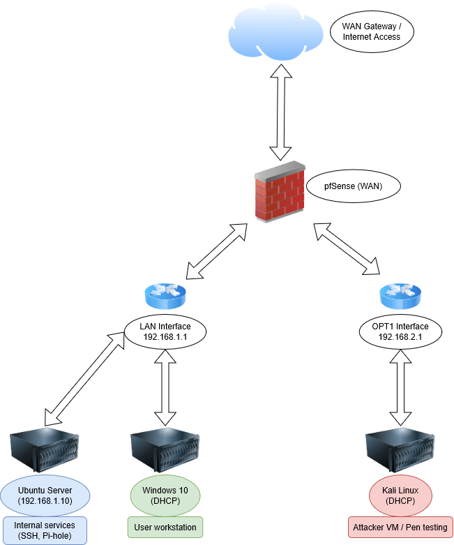

# Home Lab: IT Networking & Security Simulation

This is a self-directed home lab built to simulate a small office IT environment. The goal is to strengthen real-world skills in networking, system administration, and cybersecurity using open-source tools and virtual machines. It complements my formal certifications and customer support experience as I transition into technical IT roles.

---

## About Me

I'm Bosco Lasrado, an IT Support and Customer Experience Professional with 5+ years in customer-facing roles and recent hands-on technical training. Certified in CompTIA Network+ and Google IT Support, I'm building this home lab to sharpen skills and demonstrate initiative to prospective employers.

---

## Lab Environment

| VM Name       | OS             | Role               | IP Address      | Hostname       |
|---------------|----------------|--------------------|------------------|----------------|
| pfSense        | pfSense CE     | Firewall & Router  | 192.168.1.1      | pfsense         |
| Win10-User     | Windows 10     | Workstation        | DHCP/static     | win10-user      |
| Ubuntu-Server  | Ubuntu Server  | Internal Services  | 192.168.1.10     | blues-server     |
| Kali-Attacker  | Kali Linux     | Pentesting/Testing | DHCP/static     | blues-attack    |

---

## Project Goals

- Simulate a real-world small office IT infrastructure
- Implement firewall rules and VLAN segmentation with pfSense
- Practice system administration tasks across Linux and Windows
- Set up internal services (file sharing, web, DNS, logging)
- Test and harden systems through red-team/blue-team exercises

---

## Current Progress

- [x] Deployed pfSense with LAN/WAN configuration
- [x] Installed and configured Ubuntu Server with static IP
- [x] Created and configured Kali Linux for testing
- [x] Verified full network connectivity between VMs
- [ ] Enabled SSH access to Ubuntu Server
- [ ] Created basic pfSense firewall rules
- [ ] Documented network layout and rules

---

## Tools and Technologies Used

- VirtualBox
- pfSense CE
- Ubuntu Server 22.04
- Windows 10
- Kali Linux
- OpenSSH
- Netplan (static IP)
- ICMP/DNS/NAT troubleshooting
- Markdown (for documentation)

---

## Network Diagram



## Repo Structure
```
/README.md <- Project overview, goals, setup
/checklist.md <- Weekly or project-based to-do list
/configs/ <- Config files
├── netplan-static-ip.yaml
├── pfSense-firewall-rules.md
/logs/ <- Test results, command outputs, and troubleshooting notes
├── connectivity-tests.md
└── troubleshooting-notes.md
/diagrams/ <- Network diagrams
└── network-topology.drawio
```
