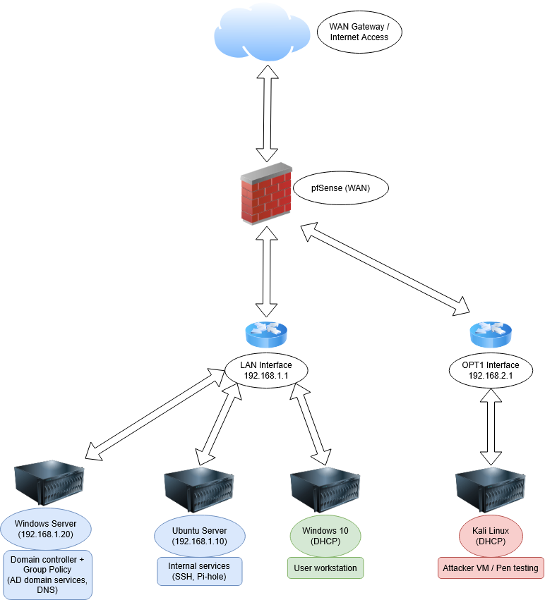

# Home Lab: IT Networking & Security Simulation

## **Project Status : Completed**

---

## About Me

An IT Support and Customer Experience Professional with 5+ years in customer-facing roles and recent hands-on technical training. Certified in CompTIA Network+ and Google IT Support, this home lab was built to sharpen real-world skills and demonstrate initiative to prospective employers.

---

## Project Goal & Summary

This project's goal was to build a virtual small office IT environment from the ground up to practice and demonstrate skills in networking, system administration, and cybersecurity. The lab is built on a pfSense firewall that provides routing and VLAN segmentation, creating a secure, multi-layered network. The environment includes a Linux server, a Windows client, and a Kali Linux machine for security testing.

---

## Final Lab Environment

| VM Name        | OS                  | Role               | IP Address      | Hostname       |
|----------------|---------------------|--------------------|-----------------|----------------|
| pfSense        | pfSense CE          | Firewall & Router  | `192.168.1.1`   | `pfsense`      |
| Win10-User     | Windows 10          | Workstation        | DHCP/static     | `win10-user`   |
| Ubuntu-Server  | Ubuntu Server       | Internal Services  | `192.168.1.10`  | `blues-server` |
| Kali-Attacker  | Kali Linux          | Pentesting/Testing | DHCP/static     | `blues-attack` |
| DC01           | Windows Server 2022 | Domain Controller  | `192.168.10.10` | `DC01`         |

---

## Network Diagram

---

## Key Features & Configuration

- **Firewall & Network Segmentation:** Deployed pfSense and configured it to create multiple VLANs, successfully segmenting traffic between server, workstation, and security testing subnets. Firewall rules were implemented and tested to block unauthorized traffic between segments.
- **System Administration:** Deployed and configured both Linux (Ubuntu Server) and Windows (Windows 10, Windows Server 2022) virtual machines, including static IP configuration and enabling SSH for remote management.
- **Active Directory Implementation:** Installed and configured a Windows Server 2022 Domain Controller for the `homelab.local` domain. This include
   * Installing Active Directory Domain Services (AD DS) and DNS server roles.
   * Creating Organizational Units (OUs) for users, groups, and computers.
   * Creating test user accounts and security groups (`IT_Staff`, `HR_Staff`).
   * Successfully joining a Windows 10 client to the domain.
- **Group Policy Management (GPO):** Practiced applying Group Policy Objects to enforce security settings (e.g., password policies) and manage the user environment, simulating common administrative tasks.

---

## Tools and Technologies Used

- pfSense CE
- Ubuntu Server 22.04
- Windows 10 / Windows Server 2022
- Kali Linux
- Active Directory Domain Services (AD DS)
- Group Policy (GPO)
- DNS / DHCP
- VLANs / Network Segmentation
- OpenSSH
- Markdown

---

## Potential Improvements

While the project has met its core objectives, future work could explore:

- Deploying a second Domain Controller for redundancy.
- Diving deeper into Group Policy Preferences for more granular control.
- Practicing advanced Active Directory security hardening techniques.
- Integrating other services with AD for centralized authentication (e.g., pfSense VPN, Nextcloud).
- Joining the Linux server to the domain using `realmd` and `sssd`.

---

## Conclusion & Learning Outcomes

This project provided comprehensive, hands-on experience in designing, building, and managing a simulated corporate network. It successfully demonstrates the ability to administer a hybrid environment of both Linux and Windows systems.

Key skills demonstrated include enterprise networking with pfSense (VLANs, firewall rules), Windows Server administration (AD DS, DNS, GPO), and fundamental cybersecurity practices (network segmentation, security testing). This lab served as a critical step in translating theoretical knowledge into practical, resume-worthy skills relevant to IT Support, System Administrator, and NOC roles.

